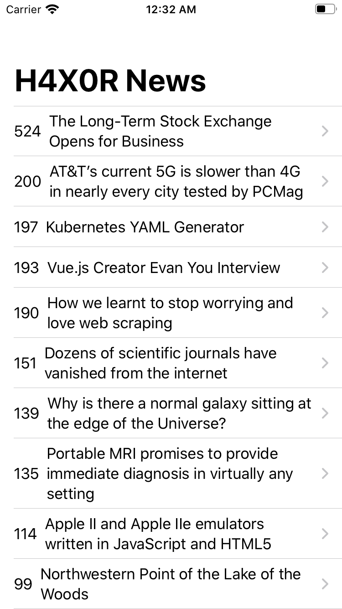
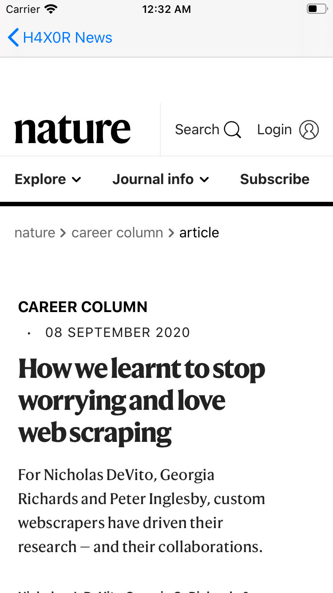

#  H4X0R News
A News iOS Application .
This application fetches latest news from "https://news.ycombinator.com/" using an API, then parses the result data and displays headlines in a UITableView. When a row is selected the source news is displayed as WebView using WebKit.

This application is part of <a href="">iOS Application Development Bootcamp</a> course by Dr. Angela Yu, TheAppBrewery.

## Screenshots
 

## Technologies
<a href="">Swift Programming Language</a> | <a href="">SwiftUI</a> | <a href="">WebKit</a>
